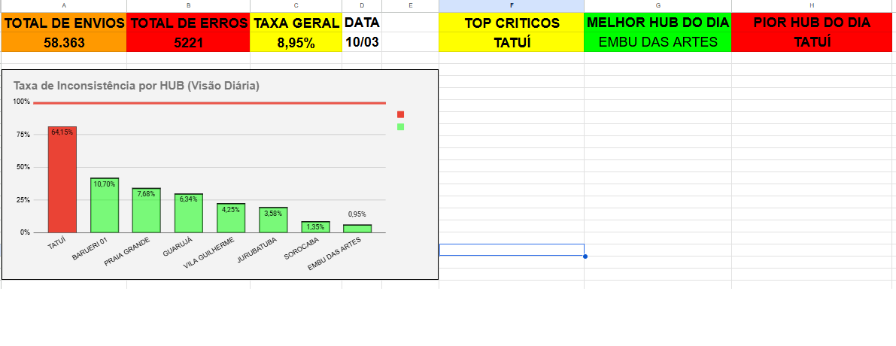
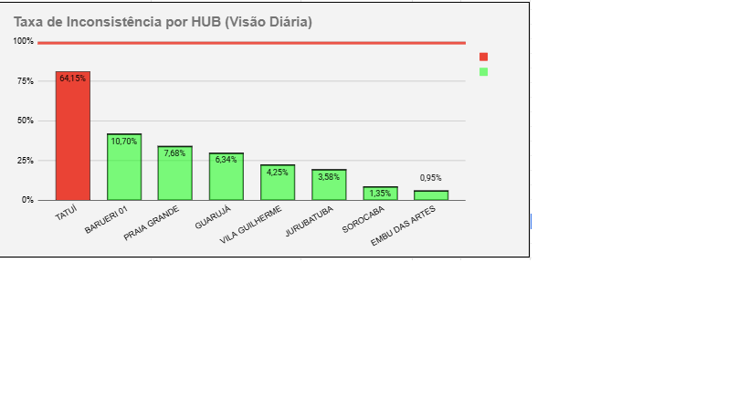
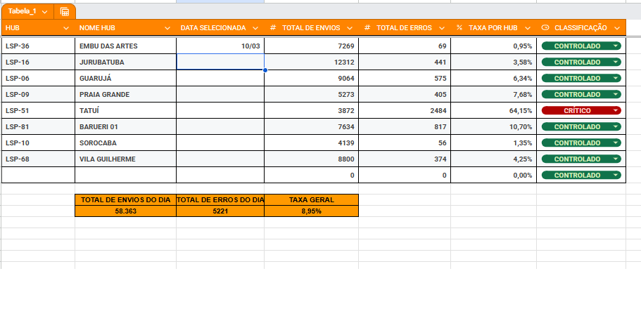

# 📊 Dashboard de Inconsistência por HUB

Projeto de análise de dados focado no monitoramento de inconsistências operacionais por HUB logístico.

---

## 🎯 Objetivo

Identificar e priorizar hubs com maior taxa de inconsistência, permitindo ações rápidas na operação.

---

## 🧠 Problema

Dificuldade em visualizar rapidamente quais hubs apresentavam falhas operacionais e qual a gravidade dessas inconsistências.

---

## 💡 Solução

Desenvolvimento de um dashboard com:

- Cálculo de taxa de inconsistência por HUB  
- Classificação automática (Controlado, Atenção, Crítico)  
- Visualização dinâmica por data  
- Destaque visual de hubs problemáticos  
- Linha de meta operacional (15%)  

---

## ⚙️ Ferramentas utilizadas

- Google Sheets (tratamento de dados)  
- Google Looker Studio (visualização)  

---

## 📊 Principais métricas

- Total de envios  
- Total de erros  
- Taxa de inconsistência  
- Ranking de hubs  

---

## 🎨 Visual do Dashboard

### 📊 Dashboard Completo

---

### 📈 Análise por HUB

---

### 🧠 Estrutura de Dados

---

## 🚀 Aprendizados

- Estruturação de dados para análise  
- Criação de métricas operacionais  
- Aplicação de regras de negócio em dashboards  
- Visualização orientada à tomada de decisão  

---

## 🔗 Acesse o dashboard

((https://lookerstudio.google.com/reporting/dd9112fd-5685-4aa2-9576-91905b5ba519))
